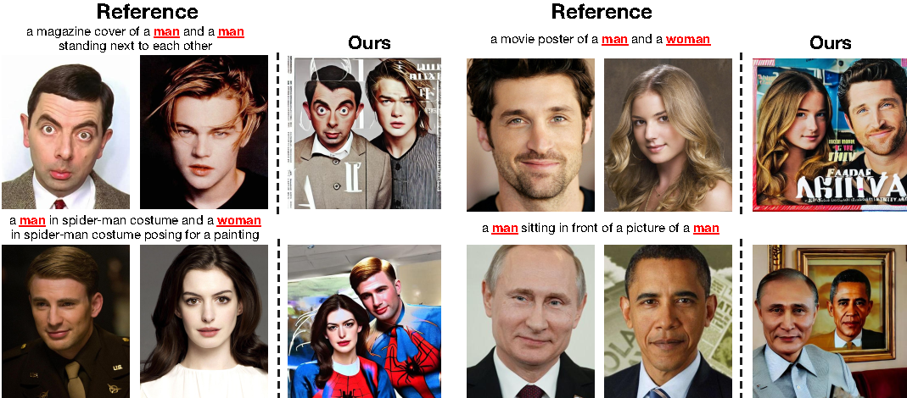
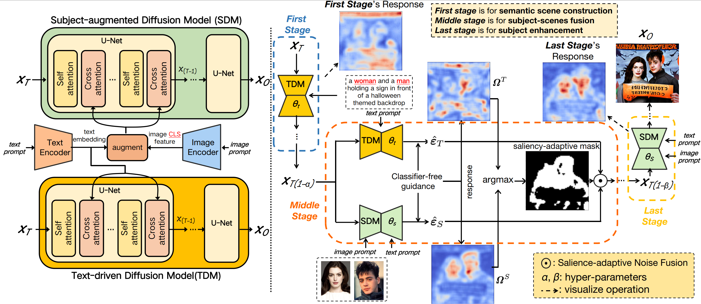

<div align="center">
<h1>High-fidelity Person-centric Subject-to-Image Synthesis</h1>


[Yibin Wang](https://codegoat24.github.io)\*, [Weizhong Zhang](https://weizhonz.github.io/)\*, [Jianwei Zheng](https://zhengjianwei2.github.io/)&#8224;, [Cheng Jin](https://cjinfdu.github.io/)&#8224; 

(*equal contribution, &#8224;corresponding author)

[Fudan University]

CVPR 2024

<a href="https://arxiv.org/pdf/2311.10329.pdf">
</a>

</div>

 
 
## 📖 Abstract

Current subject-driven image generation methods encounter significant challenges in person-centric image generation. The reason is that they learn the semantic scene and person generation by fine-tuning a common pre-trained diffusion, which involves an irreconcilable training imbalance. Precisely,  to generate realistic persons, they need to sufficiently tune the pre-trained model, which inevitably causes the model to forget the rich semantic scene prior and makes scene generation over-fit to the training data. 
Moreover, even with sufficient fine-tuning, these methods can still not generate high-fidelity persons since joint learning of the scene and person generation also lead to quality compromise. In this paper, we propose  Face-diffuser, an effective collaborative generation pipeline to eliminate the above training imbalance and quality compromise. Specifically, we first develop two specialized pre-trained diffusion models, i.e., Text-driven Diffusion Model (TDM) and Subject-augmented Diffusion Model (SDM), for scene and person generation, respectively. The sampling process is divided into three sequential stages, i.e., semantic scene construction, subject-scene fusion, and subject enhancement. The first and last stages are performed by TDM and SDM respectively. The subject-scene fusion stage, that is the collaboration achieved through a novel and highly effective mechanism, Saliency-adaptive Noise Fusion (SNF). Specifically, it is based on our key observation that there exists a robust link between classifier-free guidance responses and the saliency of generated images. In each time step, SNF leverages the unique strengths of each model and allows for the spatial blending of predicted noises from both models automatically in a saliency-aware manner, all of which can be seamlessly integrated into the DDIM sampling process. Extensive experiments confirm the impressive effectiveness and robustness of the Face-diffuser in generating high-fidelity person images depicting multiple unseen persons with varying contexts.





## 🔧 Environment Setup

```bash
conda create -n face-diffuser python=3.10
conda activate face-diffuser
pip install torch torchvision torchaudio
pip install transformers==4.25.1 accelerate datasets evaluate diffusers==0.16.1 xformers triton scipy clip gradio

python setup.py install
```

## ⏬ Download the Pre-trained Models

We provide two models, SDM and TDM, respectively.
* [SDM](https://huggingface.co/CodeGoat24/Face-diffuser/tree/main/SDM)
* [TDM](https://huggingface.co/CodeGoat24/Face-diffuser/tree/main/TDM)

The two pre-trained models should be put in paths: 'model/SDM' and 'model/TDM' respectively.

## 🔥 Inference
```bash
bash scripts/run_inference.sh
```
To generate higher-quality images, please modify the '--object_resolution' in run_inference.sh based on the input reference images.

## 💻 Training
Prepare the FFHQ training data:
  
```bash 
cd data
wget https://huggingface.co/datasets/mit-han-lab/ffhq-fastcomposer/resolve/main/ffhq_fastcomposer.tgz
tar -xvzf ffhq_fastcomposer.tgz
```

and then run training:
```bash
bash scripts/run_training.sh
```


## 🎫 License
For non-commercial academic use, this project is licensed under [the 2-clause BSD License](https://opensource.org/license/bsd-2-clause). 
For commercial use, please contact [Cheng Jin](jc@fudan.edu.cn).

## 🖊️ BibTeX

If you find Face-diffuser useful or relevant to your research, please kindly cite our paper:

```bibtex
@inproceedings{face-diffuser,
  title={High-fidelity Person-centric Subject-to-Image Synthesis},
  author={Wang, Yibin and Zhang, Weizhong and Zheng, Jianwei and Jin, Cheng},
  booktitle={Proceedings of the IEEE/CVF Conference on Computer Vision and Pattern Recognition},
  pages={7675--7684},
  year={2024}
}
```

## 📧 Contact

If you have any technical comments or questions, please open a new issue or feel free to contact [Yibin Wang](https://codegoat24.github.io).


## 🙏 Acknowledgements

Our work is based on [Stable-Diffusion](https://github.com/Stability-AI/stablediffusion), thanks to all the contributors!
